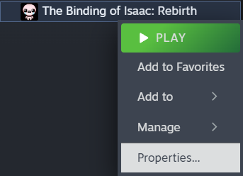
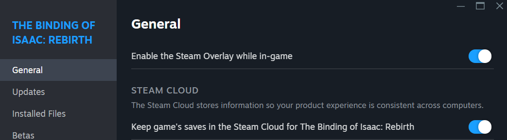

# Isaac Unlock Tracker

A simple app to visualize your Binding of Isaac: Repentance save progress and the best unlocks remaining.

It shows:
- Character unlocks and the items they unlock, ranked by quality
- Challenge unlocks and their unlocks, ranked by quality.

This helps you prioritize the best unlocks first.

## Features

- **Dashboard support**: Streamlit UI support to show the unlocks done and remaining and be able to sort the by quality.
- **CLI Support**: Simple console support to show the unlocks done and remaining.

## Requirements

- Python 3.7+
- Binding of Isaac: Repentance (with an existing save file)

## Installation

1. Clone this repository:
   ```
   git clone https://github.com/luisgtez/isaac-best-unlocks
   cd isaac-unlock-tracker
   ```

2. Install the required dependencies:
   ```
   pip install -r requirements.txt
   ```

## Usage

### Streamlit Usage
1. Run the `run-ui.bat` file. A browser window should open with the UI
2. Upload your game save file i.e.: `rep+persistentgamedata1.dat` the last number of the file name may change depending on the profile that you want to explore.
3. Now a table with your progress data should appear, you can sort by quality by clicking in the "Quality" column.

### CLI Usage
1. Run the `./src/cli-ui.py -f <SAVE_FILE_PATH>` file passing the path to your save file. This will show your progress in the console.

2. To sort by quality or completed look into the file code for some examples on how to sort.

## Where to find the save-file:

Where your save file is stored depends on whether you have Steam Cloud enabled or not.

### 🔹 If Steam Cloud is enabled:

1. The save files for steam cloud are located in `C:\Program Files (x86)\Steam\userdata\<SteamID3>\250900\remote`

2. Here pick the file with contains `rep+` and ends with the number of the profile you want to use for the progress tracker.

> 💡 If there is more than 1 folder in your `userdata` directory, to find your steam ID3: Search your account profile in a page like https://steamid.io/ under steamID3, the numbers after the second colon (``:``) are your ID and the name of the folder you should use. 

### 🔸 If Steam Cloud is disabled (Local Save):

- Navigate to:  
  `C:\Users\<YourUsername>\Documents\My Games\Binding of Isaac Repentance+\`  
- The file you're looking for is usually named `rep+persistentgamedata<number>.dat`.Where number is the profile that you want to use (the 3 profiles you choose when entering the game)

### If you are not sure you are using steam cloud to save your games

1. Navigate to your steam app library
2. Right-click on isaac game entry and click ``Properties...``  
2. Under `General` you can check wether Steam Cloud is enabled or not.  


## Future Improvements

- Add an explanation on where to find the save file (either if playing with steam cloud or locally).
- Adding more filters to visual interface (allow multiple column sorting).
   - Adding filters over which data to show based on if the challenge/character is unlocked or not.
   - Adding filters to choose between searching only characters, challenges, normal characters or tainted characters.
- Improving visual interface with characters and items images.
- Adding random picker based on what completitions are left.
   - Adding optional weigthed random picker based on quality of completitions left.
- Add file validation.
- Add tier list modifications created by users to change quality of challenges and other unlocks.

## Thecnical Improvements

- Fix standalone first click refresh bug.
- Refactor into multipage streamlit app.


## Credits

- Unlock data bytes extraction logic forked from [jamesthejellyfish/isaac-save-edit-script](https://github.com/jamesthejellyfish/isaac-save-edit-script)
- Character unlock quality info from [Another Matt Playing Isaac – "Ranking Isaac Characters BY THEIR UNLOCKS"](https://www.youtube.com/watch?v=1I-RolW_WEc) and [his spreadsheet](https://docs.google.com/spreadsheets/d/1w-JBw7sffHek3eckmz3dMXk0cyN_mV8y52xbRv1b9yw/edit?usp=sharing)
- Challenge unlock quality from [ScrotalKahnJr's Reddit comment](https://www.reddit.com/r/bindingofisaac/comments/mvdh4z/comment/gvduchv/)


## License

MIT License